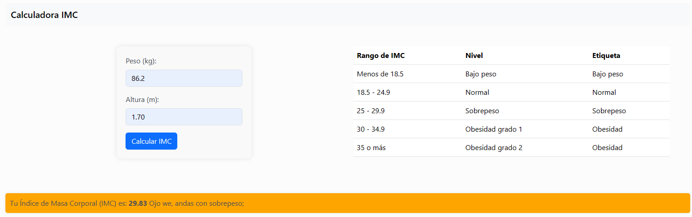

# Calculadora de Índice de Masa Corporal (IMC)

Esta es una aplicación simple de calculadora de Índice de Masa Corporal (IMC) desarrollada con Express.js y HTML/CSS utilizando Bootstrap para el diseño. La aplicación permite a los usuarios ingresar su peso y altura para calcular su IMC y muestra el resultado junto con un mensaje según su estado de peso.



Esta aplicacion es mas que nada un pequeño ejercicio de la dockerizacion o el uso de imagenes para correr proyectos pequeños o grandes, virtualizar las aplicaciones de modo que se puedan crear ya sean aplicaciones grande o pequeñas dentro de nuestra computadora.

Tambien sirve como precedente antes usar docker para hacer aplicaciones de microservicios en un solo servidor o en varios servidores de forma rapida en docker por medio de los Dockerfiles que creas siguiende los pasos que se necesitarian para dejar todo listo y lo ejecutas para automatizar la app y hacer que sea mas facil ejecutarla.

### Ejemplo de Dockerfile
```
# Usa la imagen de alpine como base
FROM node:14-alpine

# Establece el directorio de trabajo dentro del contenedor
WORKDIR /app

# Copia los archivos de tu aplicación al directorio de trabajo del contenedor
COPY package.json package-lock.json /app/
COPY server.js /app/

# Instala las dependencias
RUN npm install

# Expone el puerto 3000 para que pueda accederse desde fuera del contenedor
EXPOSE 3000

# Comando para iniciar la aplicación cuando se ejecute el contenedor
CMD ["node", "server.js"]
```

## Instalación y Uso

### Requisitos Previos

- Node.js instalado en tu sistema.

### Pasos para Ejecutar la Aplicación Localmente

1. **Clona este repositorio en tu máquina local:**

    ```bash
    git clone https://github.com/tu_usuario/calculadora-imc.git
    ```

2. **Ve al directorio del proyecto:**

    ```bash
    cd calculadora-imc
    ```

3. **Instala las dependencias del proyecto:**

    ```bash
    npm install
    ```

4. **Inicia la aplicación:**

    ```bash
    npm start
    ```

5. **Abre tu navegador web y visita [http://localhost:3000](http://localhost:3000) para ver la aplicación en funcionamiento.**

## Dockerización

Si prefieres ejecutar la aplicación en un contenedor Docker, sigue estos pasos:

1. **Asegúrate de tener Docker instalado en tu sistema.**

2. **Crea una imagen Docker para la aplicación. Desde la raíz del proyecto, ejecuta:**

    ```bash
    docker build -t calculadora-imc .
    ```

3. **Ejecuta un contenedor basado en la imagen que acabas de crear:**

    ```bash
    docker run -d -p 3000:3000 calculadora-imc
    ```

4. **Visita [http://localhost:3000](http://localhost:3000) en tu navegador web para ver la aplicación en funcionamiento dentro del contenedor Docker.**

## Estructura del Proyecto

- `server.js`: Archivo principal de la aplicación que contiene la lógica de Express.js para manejar las solicitudes HTTP.
- `index.html`: Página HTML que contiene el formulario de entrada para ingresar peso y altura.
- `styles.css`: Archivo CSS para estilizar la página HTML.
- `Dockerfile`: Archivo Dockerfile que define cómo construir la imagen Docker para la aplicación.
